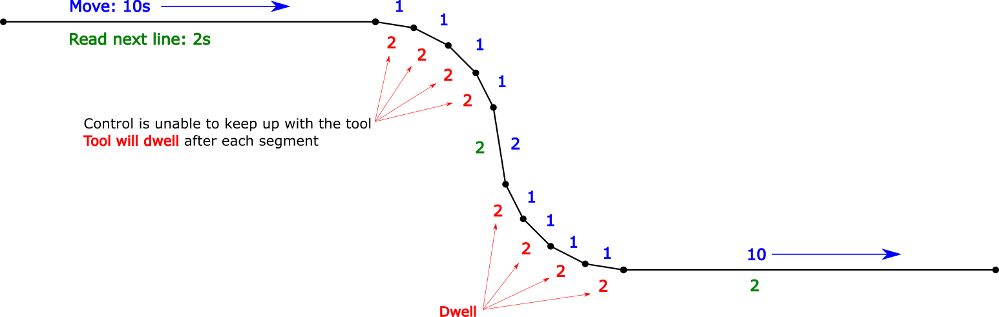

# feed-optimizer
Strategically adjust the feed rate in a GCODE file to allow smooth cuts when drip feeding an older control

## The problem to solve:
Older CNC controls with limited memory can be "drip fed" a program in a variety of ways that are typically quite slow by today's standards.  As an example, the Fanuc 6MB can be fitted with an emulator for the punched paper tape reader, allowing it to run any length/size of file, streamed from a PC via serial.  There is a limit to how fast data can be transferred resulting in a situation where the physical movement of the machine is completed before the next instruction has been read.  The result is a tool that dwells between lines - making awful sounds, bad surface finish, poor tool life, etc.

## Strategies:
Beyond buying a newer machine or retrofitting an old one, there are some strategies to mitigate this issue that are beyond the scope of this project, including:
* Avoiding very short line segments
* Tweaking options in the CAM software to generate arcs to cut surfaces instead of lines
* Physically decreasing the size of the file by removing line numbers, spaces, comments, etc
* **Lowering the overall feed rate in the program or overriding on the control

## The Goal:
Adjust the feed rates as required on a line-by-line basis so that the next program line is ready to go just as the previous one is completed, thereby smoothing out the motion.  The effectiveness will depend on nature of the original program, and it may be possible to shorten the run time in situations where the feed rate had been lowered to the lowest smooth speed (sacrificing speed on longer moves to prevent dwelling on short ones).

## How it (hopefully) works:
1. Determine communication speed for the control (expirementally or just guess)
2. Calculate the distance and communication time for each line
3. Calculate the maximum feed rate for each line, then modify it

## What it doesn't do:
* Anything other than straight lines and arcs (G01, G02 and G03).
* Rapids are excluded, as well as canned cycles.
* Arcs using R (IJK is working, R - not yet)

To do:
* Test incrimental files - they should work, but all testing has been with absolute
* Validate the result for helical arcs
