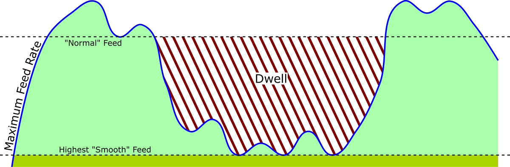

# feed-optimizer
Strategically adjust the feed rate in a GCODE file to allow smooth cuts when drip feeding an older control

### Status: Working prototype

## The problem to solve:
Older CNC controls with limited memory can be "drip fed" a program in a variety of ways that are typically quite slow by today's standards.  As an example, the Fanuc 6MB can be fitted with an emulator for the punched paper tape reader, allowing it to run any length/size of file, streamed from a PC via serial.  There is a limit to how fast data can be transferred resulting in a situation where the physical movement of the machine is completed before the next instruction has been read.  The result is a tool that dwells between lines - making awful sounds, bad surface finish, poor tool life, etc.

## Strategies:
Beyond buying a newer machine or retrofitting an old one, there are some strategies to mitigate this issue that are beyond the scope of this project, including:
* Avoiding very short line segments
* Tweaking options in the CAM software to generate arcs to cut surfaces instead of lines
* Physically decreasing the size of the file by removing line numbers, spaces, comments, etc
* **Lowering the overall feed rate in the program or overriding on the control**

The clever graphic below tries to illustrate the situation, particularly how using a single feed rate can be sub-optimal:

* Slowing down to the lowest feed feed that avoids starving the control prevents dwelling but sacrifices speed and time for parts of the program that aren't bottlenecked (light green)
* Using a higher feed rate appropriate for the tool causes it to dwell (red)
* The best feed rate is variable and stays very close to the maximum, capped at the maximum feed rate for the tool

## The Goal:
Adjust the feed rates as required on a line-by-line basis so that the next program line is ready to go just as the previous one is completed, thereby smoothing out the motion.  The effectiveness will depend on nature of the original program, and it may be possible to shorten the run time in situations where the feed rate had been lowered to the lowest smooth speed (sacrificing speed on longer moves to prevent dwelling on short ones).

## How it (hopefully) works:
1. Determine communication speed for the control (expirementally or just guess)
2. Calculate the distance and communication time for each line
3. Calculate the maximum feed rate for each line, then modify it

## What it doesn't do:
* Anything other than straight lines and arcs (G01, G02 and G03).
* Rapids are excluded, as well as canned cycles.
* Arcs using R (IJK is working, R - not yet)
* Account for acceleration or lookahead in the control

## Setting the settings - determining the communication speed
The goal is to determine the relationship between the number of characters on a line and the time it takes for the control to process it.  The approach is to create two files with the exact same motion on each line - one with a small character count and one much longer.  This allows us to get a rough guess on the fixed time required per line as well as the impact of the line length.  These steps are meant for inches and IPM, however as long as you know the distance moved in the same units as your feed it shouldn't impact the calculation (mm and mm/m for example).

### 1. Set up test programs
Two samples are available in the /test_programs/ directory.  Each line moves .005"; the short file lines are 6 characters and the long file lines are 37.  You may need to adjust the formatting to match what your machine requires.  Note the distance and length of the lines for later.
### 2. Set up the machine
The idea here is to hit cycle start then judge if the program runs smoothly or not.  The test files provided here only move a total distance of .500", so it may be difficult to tell by eye or touch.  Two methods that work well are to set up a travel dial indicator and watching the needle, and listening to your servo motors - it should be easy to hear the difference between a smooth movement and stop/starts.
### 3. Find the threshold
Run the program, watch the machine.  If it moves smoothly, crank up the feed on the override until it doesn't.  If it isn't smooth, dial the feed down until it is.  Once you find the spot, edit the feed in the files to match what you measured (original feed * override percent), then repeat the test.  If you're dealing with small feeds (under 5 or so) it is best to repeat the test until it is tough to see a big difference between steps on the knob (within .1 or .2 ipm for example).  Record this feed rate, then repeat the test with the other file.
### 4. Calculate rough timing
At this point you should have a distance, two character counts, and two feed rates.  There is a calculator on the "advanced" tab that will do the math, the wordy version of this is: 
1. Multiply the distance by the feed rate to find the elapsed time, convert to milliseconds.  Do this for both tests.
2. Take the difference in time and the difference in character counts from both tests, then divide the time difference by the character difference.  This gives milliseconds per character.  Multiply this by 10 and this is the character time factor (this multiplicaiton is to give more resolution on the input slider).
3. For either test, multiply the character count by the milliseconds per character, then subtract this from the total elapsed time for that test.  This gives the block (line) time factor.
### 5. Input the results, then test
You should now have two numbers, one is a factor for the overhead per line, the other is a factor for how the time each additional character adds.  Input these using the sliders on the "machine settings" tab.  A good first test is to take the original test file and run it with the "optimize feed rate" box checked.  If the feed rate in the output file is similar to the one you determined expirimentally that is a good sign.  This process isn't absolutely accurate, so it makes sense to do some test cuts and tweak the factors - for example, helical arcs may impose some other bottlenecks for your control so you may want to run slightly slower than the result calculated for these short lines.

To do:
* Test incrimental files - they should work, but all testing has been with absolute
* Validate the result for helical arcs
* Document process to measure the control comm speed
* Provide test files
* Build instructions
* Input validation (there is none)
* License and credits